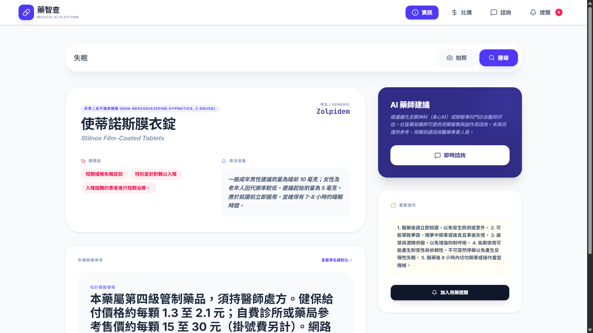
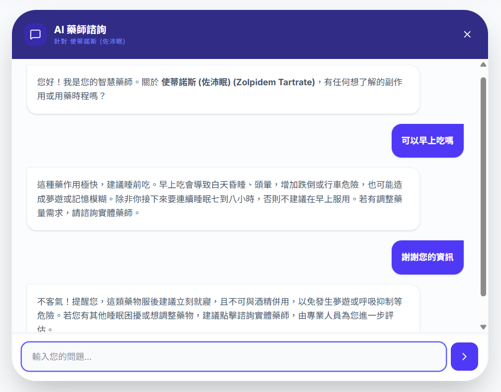

<div align="center">
  <div style="background-color: #4f46e5; width: 80px; height: 80px; border-radius: 20px; display: flex; align-items: center; justify-content: center; margin: 0 auto 20px;">
    <svg xmlns="http://www.w3.org/2000/svg" width="40" height="40" viewBox="0 0 24 24" fill="none" stroke="white" stroke-width="2" stroke-linecap="round" stroke-linejoin="round"><path d="m10.5 20.5 10-10a4.95 4.95 0 1 0-7-7l-10 10a4.95 4.95 0 1 0 7 7Z"/><path d="m8.5 8.5 7 7"/></svg>
  </div>
  <h1 align="center">MediScan 藥智查</h1>
  <p align="center"><strong>Medical AI Platform</strong></p>
  <p align="center">
    結合 Google Gemini AI 的智慧藥物分析與諮詢平台，提供即時藥物資訊、比價對比與全天候虛擬藥師諮詢服務。
  </p>
</div>

<div align="center">
  
  <br /><br />
  
</div>


## ✨ 主要功能 (Features)

- **🔍 智慧識別 (Smart Recognition)**
  輸入藥品名稱或上傳藥品照片，AI 即可自動分析成分、適應症與用法用量。
- **💰 詢價對比 (Price Comparison)**
  即時查詢原廠藥與學名藥的估計通路價格，幫助您找到最具性價比的替代方案。
- **🩺 專業諮詢 (AI Consultation)**
  內建 AI 藥師，針對查詢的藥物提供全天候的藥學問答與安全指南。
- **🔔 用藥提醒 (Medication Reminders)**
  可將藥物加入清單，設定個人化的用藥時間提醒。

## 🛠️ 技術棧 (Tech Stack)

- **前端框架**: React 19 + TypeScript + Vite
- **UI & 樣式**: Tailwind CSS, Lucide React, Motion
- **AI 整合**: Google Gemini API (`@google/genai`)

## 🚀 本地開發 (Run Locally)

**環境要求:** Node.js 18+

1. **安裝依賴套件**:
   ```bash
   npm install
   ```

2. **設定環境變數**:
   請將專案目錄下的 `.env.example` 複製一份並命名為 `.env.local`，然後填入您的 Gemini API Key：
   ```env
   VITE_GEMINI_API_KEY=your_api_key_here
   ```

3. **啟動開發伺服器**:
   ```bash
   npm run dev
   ```
   應用程式將預設在 `http://localhost:3000` 運行。

## ⚠️ 免責聲明 (Disclaimer)

**本系統提供之所有資訊僅供參考，不具任何醫療診斷效力。** 
實際用藥前請務必諮詢專業醫師或藥師。系統對於資訊的絕對準確性或因使用本服務而產生的任何後果不負法律責任。

---
© 2026 MediScan AI.
